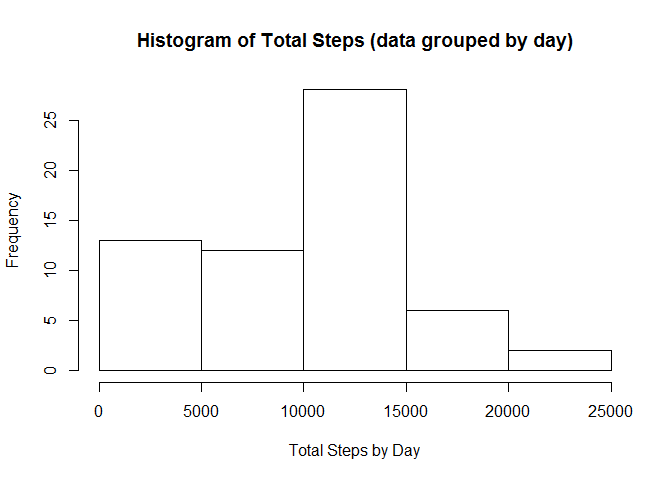
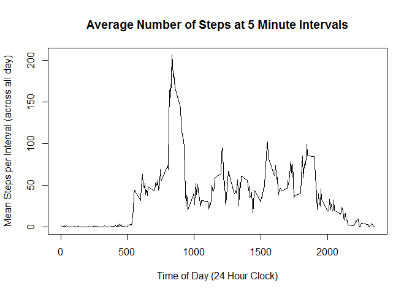
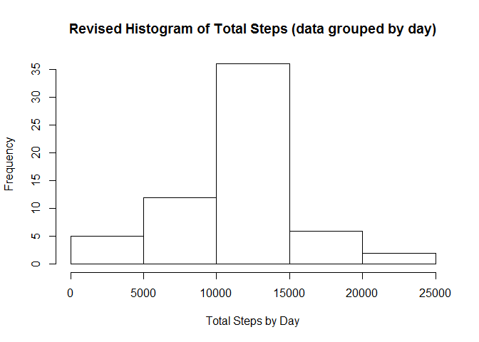
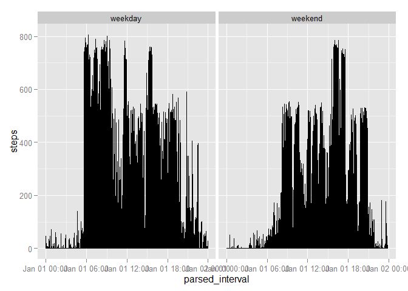

# Reproducible Research: Peer Assessment 1


## Loading and preprocessing the data


```r
## load libraries
library("plyr")
```

```
## Warning: package 'plyr' was built under R version 3.1.3
```

```r
library("dplyr")
```

```
## 
## Attaching package: 'dplyr'
## 
## The following objects are masked from 'package:plyr':
## 
##     arrange, count, desc, failwith, id, mutate, rename, summarise,
##     summarize
## 
## The following object is masked from 'package:stats':
## 
##     filter
## 
## The following objects are masked from 'package:base':
## 
##     intersect, setdiff, setequal, union
```

```r
library("tidyr")
library("lubridate")
```

```
## 
## Attaching package: 'lubridate'
## 
## The following object is masked from 'package:plyr':
## 
##     here
```

```r
library("knitr")
```

```
## Warning: package 'knitr' was built under R version 3.1.3
```

```r
library("lattice")
```

```
## Warning: package 'lattice' was built under R version 3.1.3
```

```r
library("ggplot2")
```

```
## Warning: package 'ggplot2' was built under R version 3.1.3
```

```r
## download data to working directory
download.file("https://d396qusza40orc.cloudfront.net/repdata%2Fdata%2Factivity.zip","ProjectOne",method="curl")
```

```
## Warning: running command 'curl "https://d396qusza40orc.cloudfront.net/
## repdata%2Fdata%2Factivity.zip" -o "ProjectOne"' had status 127
```

```
## Warning in download.file("https://d396qusza40orc.cloudfront.net/repdata
## %2Fdata%2Factivity.zip", : download had nonzero exit status
```

```r
## unzip data
unzip("ProjectOne")

## read in file including headers
activity<-read.csv("activity.csv",header=TRUE)

## convert dates to useful format
activity$date<-ymd(activity$date)
```


## What is mean total number of steps taken per day?


```r
## group by date
grouped_activities<-tbl_df(activity)
grouped_activities<-group_by(grouped_activities,date)
## sum steps by date and write to new variable. NB: NA's are removed when calling sum function
total_steps<-summarise(grouped_activities,sum(steps,na.rm=TRUE))
```


```r
hist(total_steps$sum,main="Histogram of Total Steps (data grouped by day)",xlab="Total Steps by Day")
```

 


```r
## calculate mean total steps
mean_total_steps<-mean(total_steps$sum,na.rm=TRUE)
## print mean total steps
print("Mean Total Steps")
```

```
## [1] "Mean Total Steps"
```

```r
mean_total_steps
```

```
## [1] 9354.23
```

```r
## calculate median total steps
med_total_steps<-median(total_steps$sum,na.rm=TRUE)
## print median total steps
print("Median Total Steps")
```

```
## [1] "Median Total Steps"
```

```r
med_total_steps
```

```
## [1] 10395
```


## What is the average daily activity pattern?

```r
## group by intervals
intervals<-group_by(activity,interval)
## mean steps by day in a new variable (NA's ignored)
steps_by_day<-summarise(intervals,mean(steps,na.rm=TRUE))
## rename column name
colnames(steps_by_day)[2]<-"Mean_Steps"
## format intervals
steps_by_day<-mutate(steps_by_day,formatted_interval=sprintf("%04d", interval))
steps_by_day<-mutate(steps_by_day,parsed_interval=parse_date_time(formatted_interval,"hm"))
## plot average no. steps
plot(steps_by_day$parsed_interval,steps_by_day$Mean_Steps, type="l", ylab="Mean Steps per Interval (across all day)",xlab="Time of Day (24 Hour Clock)",main="Average Number of Steps at 5 Minute Intervals")
```

 

Which 5-minute interval, on average across all the days in the dataset, contains the maximum number of steps?

```r
## calculate max from the steps_by_day table
max_steps<-max(steps_by_day$Mean_Steps)
## filter table based on max for output
max_interval<-filter(steps_by_day,Mean_Steps==max_steps)
## print value
print(as.numeric(max_out<-max_interval[1,1]))
```

```
## [1] 835
```


## Imputing missing values

Total number of rows with NAs in dataset:


```r
## calculate complete cases
complete_cases<-complete.cases(activity)
## print out number of rows that aren't complete cases
print(as.data.frame(table(complete_cases))[1,2])
```

```
## [1] 2304
```

```r
## Devise a strategy for filling in all of the missing values in the dataset. The strategy does not need to be sophisticated. For example, you could use the mean/median for that day, or the mean for that 5-minute interval, etc.
```

_Strategy for filling in the missing values:_  
* use existing steps by day table and combine it with the activity table  
* create a function that assesses if the steps value in the combined table is NA and if it is replaces it with the mean steps for that particular day i.e. what's in the mean steps field for that row  
* run function against the steps value to create a 'new_steps' column


```r
## using the steps_by_day table already created with mean steps per interval combine into a new value
activity<-join(activity,steps_by_day)
```

```
## Joining by: interval
```

```r
## create function to assess if steps is NA or not
step_NA<-function(steps,mean_steps){
  is_value<-is.na(steps)
  if (is_value==TRUE){
    na_replace<-mean_steps
    return(na_replace)
  }
  
  return(steps)
}
## use function to create column in activities for new steps
activity<-mutate(activity,new_steps=mapply(step_NA,steps,Mean_Steps))
## convert new_steps to integer as steps are whole number
activity$new_steps<-as.integer(activity$new_steps)
## create new dataset with replaced values
revised_activities<-select(activity,new_steps,date,interval)
## rename new_steps to steps so can use same logic 
colnames(revised_activities)[1]<-"steps"
```


```r
## group by date
revised_activities<-group_by(revised_activities,date)
## calculate total steps
total_revised_steps<-summarise(revised_activities,sum(steps,na.rm=TRUE))
## rename sum variable
colnames(total_revised_steps)[2]<-"total_steps"
hist(total_revised_steps$total_steps,main="Revised Histogram of Total Steps (data grouped by day)",xlab="Total Steps by Day")
```

 

```r
## new mean value
new_mean<-mean(total_revised_steps$total_steps)
new_median<-median(total_revised_steps$total_steps)

## Do they differ?
```

Do these values differ from the estimates from the first part of the assignment? What is the impact of imputing missing data on the estimates of the total daily number of steps?


```r
print("New mean and median total steps by day - calculated after replacing NA values - are:")
```

```
## [1] "New mean and median total steps by day - calculated after replacing NA values - are:"
```

```r
print("New Mean")
```

```
## [1] "New Mean"
```

```r
print(new_mean)
```

```
## [1] 10749.77
```

```r
print("New Median")
```

```
## [1] "New Median"
```

```r
print(new_median)
```

```
## [1] 10641
```

```r
print("Original mean and medial total steps by day are:")
```

```
## [1] "Original mean and medial total steps by day are:"
```

```r
print("Original Mean")
```

```
## [1] "Original Mean"
```

```r
print(mean_total_steps)
```

```
## [1] 9354.23
```

```r
print("Original Median")
```

```
## [1] "Original Median"
```

```r
print(med_total_steps)
```

```
## [1] 10395
```

## Are there differences in activity patterns between weekdays and weekends?

```r
## identify days of week in revised activities data
revised_activities<-mutate(revised_activities,day_of_week=weekdays(date))

## create function to assign weekday or weekend

weekend_or_weekday<-function(day){
  day_out<-"weekday"
  if (day=="Saturday"|day=="Sunday"){
    day_out<-"weekend"
  }
  return(day_out)
}

## use to group
revised_activities<-mutate(revised_activities,wknd_wdy=weekend_or_weekday(day_of_week))
```

```
## Warning in if (day == "Saturday" | day == "Sunday") {: the condition has
## length > 1 and only the first element will be used
```

```
## Warning in if (day == "Saturday" | day == "Sunday") {: the condition has
## length > 1 and only the first element will be used
```

```
## Warning in if (day == "Saturday" | day == "Sunday") {: the condition has
## length > 1 and only the first element will be used
```

```
## Warning in if (day == "Saturday" | day == "Sunday") {: the condition has
## length > 1 and only the first element will be used
```

```
## Warning in if (day == "Saturday" | day == "Sunday") {: the condition has
## length > 1 and only the first element will be used
```

```
## Warning in if (day == "Saturday" | day == "Sunday") {: the condition has
## length > 1 and only the first element will be used
```

```
## Warning in if (day == "Saturday" | day == "Sunday") {: the condition has
## length > 1 and only the first element will be used
```

```
## Warning in if (day == "Saturday" | day == "Sunday") {: the condition has
## length > 1 and only the first element will be used
```

```
## Warning in if (day == "Saturday" | day == "Sunday") {: the condition has
## length > 1 and only the first element will be used
```

```
## Warning in if (day == "Saturday" | day == "Sunday") {: the condition has
## length > 1 and only the first element will be used
```

```
## Warning in if (day == "Saturday" | day == "Sunday") {: the condition has
## length > 1 and only the first element will be used
```

```
## Warning in if (day == "Saturday" | day == "Sunday") {: the condition has
## length > 1 and only the first element will be used
```

```
## Warning in if (day == "Saturday" | day == "Sunday") {: the condition has
## length > 1 and only the first element will be used
```

```
## Warning in if (day == "Saturday" | day == "Sunday") {: the condition has
## length > 1 and only the first element will be used
```

```
## Warning in if (day == "Saturday" | day == "Sunday") {: the condition has
## length > 1 and only the first element will be used
```

```
## Warning in if (day == "Saturday" | day == "Sunday") {: the condition has
## length > 1 and only the first element will be used
```

```
## Warning in if (day == "Saturday" | day == "Sunday") {: the condition has
## length > 1 and only the first element will be used
```

```
## Warning in if (day == "Saturday" | day == "Sunday") {: the condition has
## length > 1 and only the first element will be used
```

```
## Warning in if (day == "Saturday" | day == "Sunday") {: the condition has
## length > 1 and only the first element will be used
```

```
## Warning in if (day == "Saturday" | day == "Sunday") {: the condition has
## length > 1 and only the first element will be used
```

```
## Warning in if (day == "Saturday" | day == "Sunday") {: the condition has
## length > 1 and only the first element will be used
```

```
## Warning in if (day == "Saturday" | day == "Sunday") {: the condition has
## length > 1 and only the first element will be used
```

```
## Warning in if (day == "Saturday" | day == "Sunday") {: the condition has
## length > 1 and only the first element will be used
```

```
## Warning in if (day == "Saturday" | day == "Sunday") {: the condition has
## length > 1 and only the first element will be used
```

```
## Warning in if (day == "Saturday" | day == "Sunday") {: the condition has
## length > 1 and only the first element will be used
```

```
## Warning in if (day == "Saturday" | day == "Sunday") {: the condition has
## length > 1 and only the first element will be used
```

```
## Warning in if (day == "Saturday" | day == "Sunday") {: the condition has
## length > 1 and only the first element will be used
```

```
## Warning in if (day == "Saturday" | day == "Sunday") {: the condition has
## length > 1 and only the first element will be used
```

```
## Warning in if (day == "Saturday" | day == "Sunday") {: the condition has
## length > 1 and only the first element will be used
```

```
## Warning in if (day == "Saturday" | day == "Sunday") {: the condition has
## length > 1 and only the first element will be used
```

```
## Warning in if (day == "Saturday" | day == "Sunday") {: the condition has
## length > 1 and only the first element will be used
```

```
## Warning in if (day == "Saturday" | day == "Sunday") {: the condition has
## length > 1 and only the first element will be used
```

```
## Warning in if (day == "Saturday" | day == "Sunday") {: the condition has
## length > 1 and only the first element will be used
```

```
## Warning in if (day == "Saturday" | day == "Sunday") {: the condition has
## length > 1 and only the first element will be used
```

```
## Warning in if (day == "Saturday" | day == "Sunday") {: the condition has
## length > 1 and only the first element will be used
```

```
## Warning in if (day == "Saturday" | day == "Sunday") {: the condition has
## length > 1 and only the first element will be used
```

```
## Warning in if (day == "Saturday" | day == "Sunday") {: the condition has
## length > 1 and only the first element will be used
```

```
## Warning in if (day == "Saturday" | day == "Sunday") {: the condition has
## length > 1 and only the first element will be used
```

```
## Warning in if (day == "Saturday" | day == "Sunday") {: the condition has
## length > 1 and only the first element will be used
```

```
## Warning in if (day == "Saturday" | day == "Sunday") {: the condition has
## length > 1 and only the first element will be used
```

```
## Warning in if (day == "Saturday" | day == "Sunday") {: the condition has
## length > 1 and only the first element will be used
```

```
## Warning in if (day == "Saturday" | day == "Sunday") {: the condition has
## length > 1 and only the first element will be used
```

```
## Warning in if (day == "Saturday" | day == "Sunday") {: the condition has
## length > 1 and only the first element will be used
```

```
## Warning in if (day == "Saturday" | day == "Sunday") {: the condition has
## length > 1 and only the first element will be used
```

```
## Warning in if (day == "Saturday" | day == "Sunday") {: the condition has
## length > 1 and only the first element will be used
```

```
## Warning in if (day == "Saturday" | day == "Sunday") {: the condition has
## length > 1 and only the first element will be used
```

```
## Warning in if (day == "Saturday" | day == "Sunday") {: the condition has
## length > 1 and only the first element will be used
```

```
## Warning in if (day == "Saturday" | day == "Sunday") {: the condition has
## length > 1 and only the first element will be used
```

```
## Warning in if (day == "Saturday" | day == "Sunday") {: the condition has
## length > 1 and only the first element will be used
```

```
## Warning in if (day == "Saturday" | day == "Sunday") {: the condition has
## length > 1 and only the first element will be used
```

```
## Warning in if (day == "Saturday" | day == "Sunday") {: the condition has
## length > 1 and only the first element will be used
```

```
## Warning in if (day == "Saturday" | day == "Sunday") {: the condition has
## length > 1 and only the first element will be used
```

```
## Warning in if (day == "Saturday" | day == "Sunday") {: the condition has
## length > 1 and only the first element will be used
```

```
## Warning in if (day == "Saturday" | day == "Sunday") {: the condition has
## length > 1 and only the first element will be used
```

```
## Warning in if (day == "Saturday" | day == "Sunday") {: the condition has
## length > 1 and only the first element will be used
```

```
## Warning in if (day == "Saturday" | day == "Sunday") {: the condition has
## length > 1 and only the first element will be used
```

```
## Warning in if (day == "Saturday" | day == "Sunday") {: the condition has
## length > 1 and only the first element will be used
```

```
## Warning in if (day == "Saturday" | day == "Sunday") {: the condition has
## length > 1 and only the first element will be used
```

```
## Warning in if (day == "Saturday" | day == "Sunday") {: the condition has
## length > 1 and only the first element will be used
```

```
## Warning in if (day == "Saturday" | day == "Sunday") {: the condition has
## length > 1 and only the first element will be used
```

```
## Warning in if (day == "Saturday" | day == "Sunday") {: the condition has
## length > 1 and only the first element will be used
```

```r
## format the intervals to make plot clearer
revised_activities<-mutate(revised_activities,formatted_interval=sprintf("%04d", interval))
revised_activities<-mutate(revised_activities,parsed_interval=parse_date_time(formatted_interval,"hm"))
```


```r
qplot(parsed_interval,steps,data=revised_activities,facets=.~wknd_wdy,geom="line")
```

 

