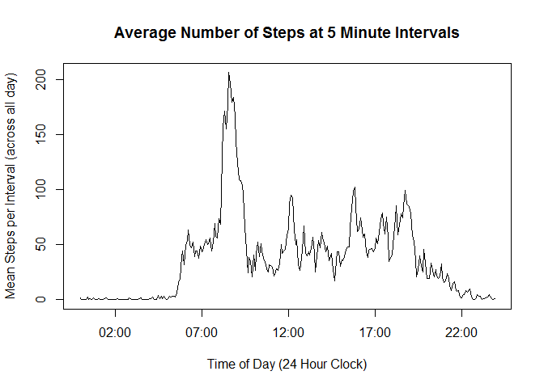

# Reproducible Research: Peer Assessment 1


## Loading and preprocessing the data


```r
## load libraries
library("plyr")
```

```
## Warning: package 'plyr' was built under R version 3.1.3
```

```r
library("dplyr")
```

```
## 
## Attaching package: 'dplyr'
## 
## The following objects are masked from 'package:plyr':
## 
##     arrange, count, desc, failwith, id, mutate, rename, summarise,
##     summarize
## 
## The following object is masked from 'package:stats':
## 
##     filter
## 
## The following objects are masked from 'package:base':
## 
##     intersect, setdiff, setequal, union
```

```r
library("tidyr")
library("lubridate")
```

```
## 
## Attaching package: 'lubridate'
## 
## The following object is masked from 'package:plyr':
## 
##     here
```

```r
library("knitr")
```

```
## Warning: package 'knitr' was built under R version 3.1.3
```

```r
## download data to working directory
download.file("https://d396qusza40orc.cloudfront.net/repdata%2Fdata%2Factivity.zip","ProjectOne",method="curl")
```

```
## Warning: running command 'curl "https://d396qusza40orc.cloudfront.net/
## repdata%2Fdata%2Factivity.zip" -o "ProjectOne"' had status 127
```

```
## Warning in download.file("https://d396qusza40orc.cloudfront.net/repdata
## %2Fdata%2Factivity.zip", : download had nonzero exit status
```

```r
## unzip data
unzip("ProjectOne")

## read in file including headers
activity<-read.csv("activity.csv",header=TRUE)

## convert dates to useful format
activity$date<-ymd(activity$date)
```


## What is mean total number of steps taken per day?


```r
## group by date
grouped_activities<-tbl_df(activity)
grouped_activities<-group_by(grouped_activities,date)
## sum steps by date and write to new variable. NB: NA's are removed when calling sum function
total_steps<-summarise(grouped_activities,sum(steps,na.rm=TRUE))
```


```r
hist(total_steps$sum,main="Histogram of Total Steps (data grouped by day)",xlab="Total Steps by Day")
```

 


```r
## calculate mean total steps
mean_total_steps<-mean(total_steps$sum,na.rm=TRUE)
## print mean total steps
print("Mean Total Steps")
```

```
## [1] "Mean Total Steps"
```

```r
mean_total_steps
```

```
## [1] 9354.23
```

```r
## calculate median total steps
med_total_steps<-median(total_steps$sum,na.rm=TRUE)
## print median total steps
print("Median Total Steps")
```

```
## [1] "Median Total Steps"
```

```r
med_total_steps
```

```
## [1] 10395
```


## What is the average daily activity pattern?

```r
## group by intervals
intervals<-group_by(activity,interval)
## mean steps by day in a new variable (NA's ignored)
steps_by_day<-summarise(intervals,mean(steps,na.rm=TRUE))
## rename column name
colnames(steps_by_day)[2]<-"Mean_Steps"
## plot average no. steps
plot(steps_by_day$interval,steps_by_day$Mean_Steps, type="l", ylab="Mean Steps per Interval (across all day)",xlab="Interval (5 min period across day)",main="Average Number of Steps at 5 Minute Intervals")
```

 

Which 5-minute interval, on average across all the days in the dataset, contains the maximum number of steps?

```r
## calculate max from the steps_by_day table
max_steps<-max(steps_by_day$Mean_Steps)
## filter table based on max for output
max_interval<-filter(steps_by_day,Mean_Steps==max_steps)
## print value
print(as.numeric(max_out<-max_interval[1,1]))
```

```
## [1] 835
```


## Imputing missing values


## Are there differences in activity patterns between weekdays and weekends?
